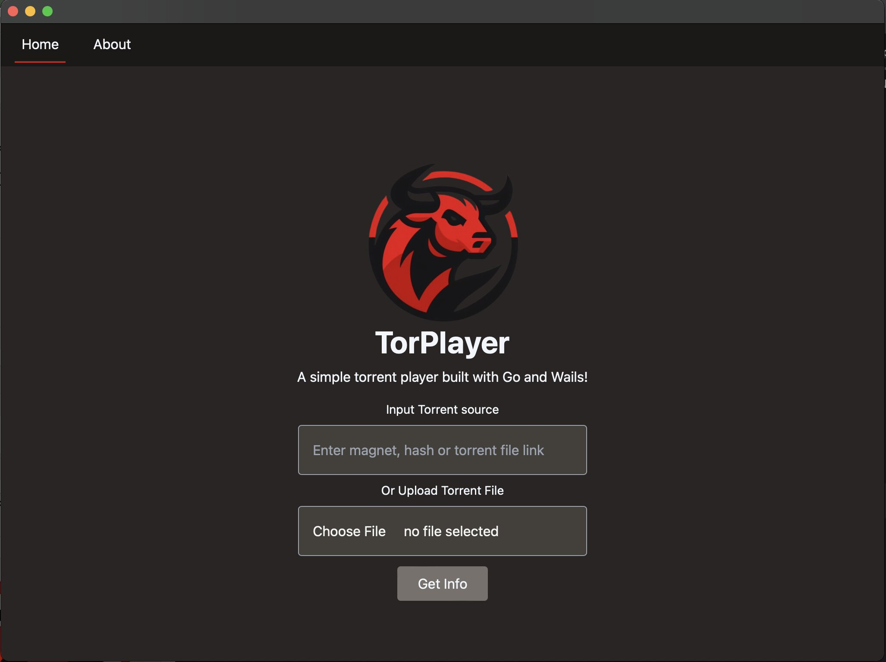
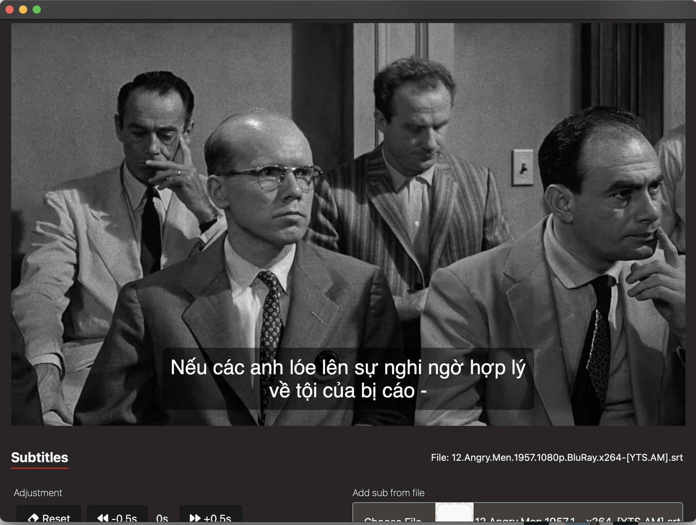

# TorPlayer


## Overview

TorPlayer is a cross-platform desktop application that allows users to stream films from the torrent network.
It is built with Wails, Vue.

## Table of Contents

- [Installation](#installation)
- [Features](#features)
- [Screenshots](#screenshots)

## Installation

```
TODO: Update late
```

## Features
- [x] Streaming mp4 files
- [x] Subtitles support
- [ ] Support mkv files

## Screenshots



